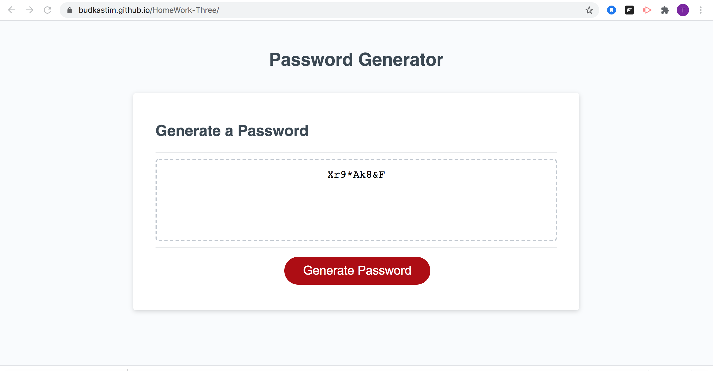

# HomeWork-Three# 03 JavaScript: Password Generator

## My Task

This week’s homework required me to create an application that an employee can use to generate a random password based on criteria they’ve selected by modifying starter code. This app will run in the browser, and will feature dynamically updated HTML and CSS powered by JavaScript code.

The password can include special characters and letters , numbers...

here is the link : https://budkastim.github.io/HomeWork-Three/

</a>